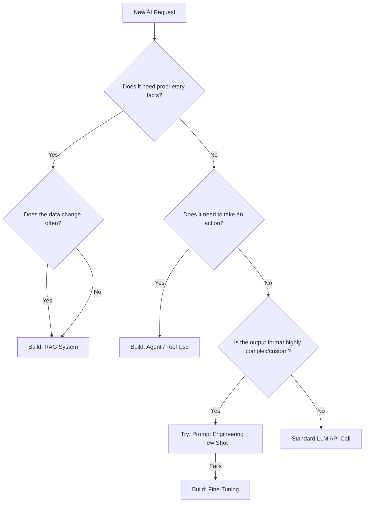

title: Key Architectures You'll Actually Use
tags:[chapter, architecture, foundation, strategy, beginner]
difficulty: beginner
last_updated: 2026-04-24
time_to_read: 15 minutes
related:
  - "[[RAG-Implementation]]"
  - "[[Agents-and-Tool-Use]]"
  - "[[Prompt-Engineering-Playbook]]"
---

# Key Architectures You'll Actually Use

> **TL;DR for the Busy IT Pro:**  
> Don't build AI from scratch. Use **RAG** when the AI needs your company's facts, use **Agents** when the AI needs to take action, use **Multimodal** to replace legacy OCR, and avoid **Fine-tuning** unless you've exhausted every other option.

---
## What You'll Learn

- [ ] The core difference between RAG, Agents, and Fine-Tuning
- [ ] Why Fine-tuning is for "Form" and RAG is for "Facts"
- [ ] How Agents turn passive chatbots into digital workers
- [ ] Using Multimodal vision to solve classic data pipeline problems
- [ ] The architectural decision matrix for enterprise use cases

---
## Why This Matters

Choosing the wrong AI architecture doesn't just result in bad answers; it results in massive technical debt and wasted budgets. 

If a stakeholder says, "We need the AI to know our new HR policies," an unguided developer might spend three weeks and $10,000 trying to *fine-tune* a model on the HR handbook. The result will hallucinate and fail. An architect who understands the landscape would spend 2 hours building a *RAG* pipeline to achieve 100% accuracy for $5.

**Real-world scenario:**  
> The Data team needs to extract tables from 10,000 messy PDF invoices. Instead of spending months writing brittle Python Regex scripts and training custom AWS Textract models, they use a **Multimodal** architecture, passing the PDFs as images to Claude 3.5 Sonnet to output perfect JSON instantly.

---
## Core Concepts

### Concept 1: RAG (Retrieval-Augmented Generation)
**What it is:** Connecting a search engine (Vector Database) to an LLM. 
**How it works:** When a user asks a question, the system searches your corporate documents, retrieves the relevant paragraphs, pastes them into the LLM prompt, and says, "Answer the user's question using only this text."
**When to use it:** Anytime the AI needs to know private, proprietary, or recently updated facts. 
*👉 Deep dive: [[RAG-Implementation]]*

### Concept 2: Agents & Tool Use (Function Calling)
**What it is:** Giving the LLM the ability to trigger your backend code.
**How it works:** You give the LLM a list of tools (e.g., `check_inventory(sku)`, `reset_password(user_id)`). The LLM determines which tool to use, outputs a JSON payload with the parameters, and *your* application executes the code.
**When to use it:** When the user needs the AI to *do* something, look up live data in an external API, or interact with a SQL database.
*👉 Deep dive: [[Agents-and-Tool-Use]]*

### Concept 3: Fine-Tuning vs. Prompt Engineering
This is the most misunderstood concept in Enterprise AI.
*   **Prompt Engineering:** Writing highly specific instructions in the context window (e.g., "Act like an IT admin, output in JSON"). 
*   **Fine-Tuning:** Actually changing the neural network weights of an open-source or API model by showing it 1,000+ examples of desired behavior.

**The Golden Rule:** *Fine-tuning is for Form. RAG is for Facts.* 
You do not fine-tune a model to teach it your Q3 earnings. You fine-tune a model to teach it to speak in the exact brand voice of your CEO, or to consistently output a highly proprietary XML schema that is too long to fit in a standard prompt.
*👉 Deep dive: [[Prompt-Engineering-Playbook]]*

### Concept 4: Multimodal Capabilities
**What it is:** AI models that natively understand text, images, and audio in the same prompt.
**How it works:** Instead of running an image through an Optical Character Recognition (OCR) engine and feeding the messy text to an LLM, you just send the image directly to the model (like `GPT-4o` or `Claude 3.5 Sonnet`). The model "sees" the layout, tables, and graphs natively.
**When to use it:** Processing complex PDFs, analyzing UI screenshots for front-end testing, or parsing diagrams.

---
## Hands-On Implementation

### Step 1: The AI Architecture Decision Tree

When a business unit requests an AI feature, use this exact flowchart to determine the architecture:

### Step 2: The Implementation Progression

Never start at the most complex architecture. Move up this ladder only when the previous step fails:
1. **Zero-Shot Prompt:** Just ask the base model to do the task.
2. **Few-Shot Prompt:** Add 3-5 examples of perfect outputs to the prompt.
3. **RAG:** Add a vector database to fetch relevant company knowledge.
4. **Agents:** Give the model API access to interact with live systems.
5. **Fine-Tuning:** Spend the money to train custom weights (rarely needed).

---
## Tips & Tricks

> [!tip] Quick Win
> Before you build a complex RAG system for a small dataset, just try "Prompt Stuffing." If your entire company handbook is only 20 pages, don't build a Vector DB. Just paste the entire handbook into the system prompt with [[Tip-Prompt-Caching]] enabled. It's faster and cheaper.

> [!tip] Pro Tip
> Combine architectures for maximum impact. An "Agentic RAG" system uses an Agent to rewrite the user's query, triggers a Tool to search the Vector DB, and triggers another Tool to search the live SQL database, combining the results.

> [!warning] Watch Out
> Don't fine-tune models to save on token costs unless you are doing massive scale (millions of daily queries). The engineering time required to clean a fine-tuning dataset will usually dwarf the savings from shorter prompts.

---
## Lessons Learned

>[!example] War Story: The Fine-Tuning Trap
> **What happened:** A department spent 2 months and $15,000 fine-tuning a custom model to answer employee questions about the company health insurance plans. It worked great until January 1st, when the deductible amounts changed. 
> **What we learned:** You cannot easily "erase" a fact from a fine-tuned model. They had to throw the model away and start over. 
> **What to do instead:** We rebuilt it using RAG in 3 days. Now, when the insurance policies change, we just delete the old PDF from the Vector DB and upload the new one. The AI is instantly updated.

---
## Best Practices Checklist

- [ ] Practice 1: **Default to RAG.** For knowledge retrieval, RAG is the enterprise standard. Accept no substitutes.
- [ ] Practice 2: **Isolate Tools.** When building Agents, write backend functions that do *one* specific thing safely. Don't give an Agent a generic "execute_code" tool.
- [ ] Practice 3: **Use Multimodal for Extraction.** Treat messy PDFs as images, not text files. 
- [ ] Practice 4: **Prove the UI first.** Use a basic prompt to mock up the application and prove the business value before committing to building complex Agent/RAG pipelines.

---
## Anti-Patterns (Don't Do This)

| ❌ Don't | ✅ Do Instead | Why |
|---------|--------------|-----|
| Fine-tune models to teach them facts | Use RAG for facts | Fine-tuned knowledge is static, cannot be cited, and is prone to hallucination. |
| Give Agents "Write" access immediately | Make Agents "Read-Only" first | Agents will hallucinate actions. Always require a human "Confirm" click for destructive actions. |
| Use OCR + Text extraction for complex forms | Use Multimodal Vision APIs | Vision models understand table columns, checkboxes, and layout hierarchy natively. |

---
## Related Topics

- [[RAG-Implementation]] - How to build the knowledge engine.
- [[Agents-and-Tool-Use]] - How to give the AI API access.
- [[Prompt-Engineering-Playbook]] - The precursor to fine-tuning.
- [[Cost-Management-and-ROI]] - How to budget for these different architectures.

---
## Further Reading

-[Anthropic: Prompt Engineering vs RAG vs Fine-Tuning](https://docs.anthropic.com/claude/docs/prompt-engineering-vs-rag-vs-fine-tuning) - Excellent breakdown of when to use what.
-[Andrej Karpathy: Software 2.0](https://karpathy.medium.com/software-2-0-a64152b37c35) - A must-read essay on how architectures are shifting from deterministic code to neural networks.

---
## Changelog

- **2026-04-24**: Created initial architecture overview.

---
## Questions or Feedback?

Not sure which architecture fits your new project? Draft a 1-paragraph summary of your goal and post it in `#ai-architecture-reviews` for feedback.
