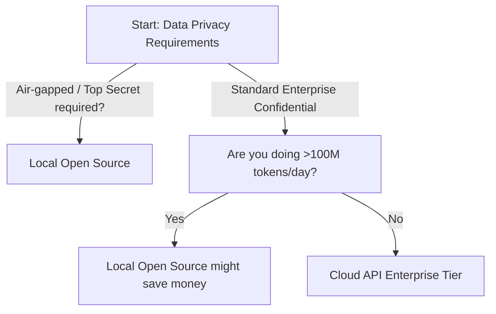

title: "Architecture: Local Open Source vs. Cloud APIs"
tags: [quick-ref, infrastructure, architecture, decision-tree]
last_updated: 2026-04-24

---
# Architecture: Local Open Source vs. Cloud APIs

> **Use this when:** Leadership asks, "Should we just run this on our own servers to protect our data?"

---
## Decision Tree

---
## Comparison Matrix

| Feature | Cloud Enterprise APIs (AWS, Azure, Anthropic) | Local Open Source (Llama 3, Mistral) |
|---------|----------|----------|
| **Setup Time** | Hours | Weeks/Months |
| **Data Privacy** | High (Zero-retention agreements) | Absolute (Air-gappable) |
| **Capex (Hardware)** | $0 | $$$$ (Requires heavy GPU clusters) |
| **Opex (Staffing)** | Low (DevOps) | High (Requires ML Engineers) |
| **Model Intelligence** | Frontier (Smarter, better reasoning) | Very Good (But trails frontier models) |

---
## The "Hidden Costs" of Local AI

Infrastructure teams often underestimate what it takes to run an LLM in production.

**If you choose Local Open Source, you are responsible for:**
1. **Hardware Procurement:** Getting H100 or A100 GPUs is difficult and extremely expensive. 
2. **Inference Servers:** You must configure and manage vLLM, TensorRT-LLM, or Ollama to serve the models.
3. **Load Balancing:** LLMs consume massive VRAM. Scaling to handle concurrent users requires complex GPU clustering.
4. **Model Updates:** Open source moves fast. You will be constantly downloading, evaluating, and deploying new weights.

---
## The IT Recommendation

**Default to Cloud Enterprise APIs.**
Unless you are a defense contractor, a highly regulated bank, or processing billions of tokens daily where API costs break the business model, **do not host your own LLMs.**

*   Use **Azure OpenAI** or **AWS Bedrock** to satisfy legal/privacy concerns (they sign BAAs and DPAs, and guarantee data is not used for training).
*   Let Microsoft/Amazon/Anthropic handle the nightmare of GPU provisioning and scaling.
*   Focus your IT resources on building applications (RAG, Agents), not managing hardware.