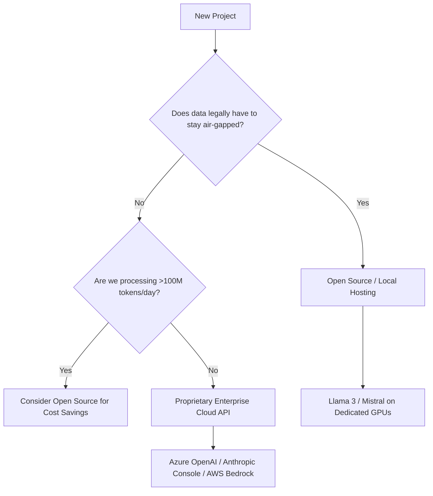

title: The Landscape - Model Evaluation & TCO
tags: [chapter, models, strategy, finops, benchmarks]
difficulty: intermediate
last_updated: 2026-04-24
time_to_read: 15 minutes
related:
  - "[[LLM-Provider-Comparison]]"
  - "[[Local-vs-Cloud-Architecture]]"
  - "[[Cost-Management-and-ROI]]"
---

# The Landscape - Model Evaluation & TCO

> **TL;DR for the Busy IT Pro:**  
> Ignore vendor marketing benchmarks—they are often contaminated. Rely on blind crowdsourced tests like LMSYS. When calculating costs, remember that Open Source models are only "free" until you pay the massive AWS/Azure bill for the GPUs required to run them.

---
## What You'll Learn

- [ ] The Open Source vs. Proprietary decision matrix
- [ ] How to interpret AI benchmarks (MMLU, HumanEval, NIAH)
- [ ] The "Vibe Check" vs. Objective Evaluation
- [ ] How to calculate Total Cost of Ownership (TCO) for Cloud APIs vs. Local Hosting

---
## Why This Matters

The AI landscape changes weekly. If an IT Architect doesn't understand how to objectively evaluate a new model, the company will suffer from "Shiny Object Syndrome"—constantly tearing down architecture to implement the newest model mentioned in the news, only to find it actually performs worse for your specific enterprise use case.

**Real-world scenario:**  
> A vendor announces a new Open Source model that "beats GPT-4o on the MMLU benchmark." Your dev team spends 3 weeks migrating your entire RAG pipeline to use it. Once in production, you realize the model is terrible at outputting JSON, breaking your backend API, and the GPU instances required to run it cost $5,000/month more than the API you were previously using. 

---
## Core Concepts

### Concept 1: Open Source vs. Proprietary APIs

You have two choices for where the "AI Brain" lives. Use this decision tree:

*   **Proprietary APIs (e.g., Anthropic, OpenAI):** You pay per token. The vendor signs a Data Processing Agreement (DPA) guaranteeing they won't train on your data. Best for 95% of enterprise use cases.
*   **Open Source (e.g., Meta Llama 3):** The model weights are free, but you pay for the infrastructure. Best for massive scale, highly classified data, or edge deployments.

### Concept 2: The Benchmark Interpretation Guide

When a new model is released, vendors publish charts with acronyms. Here is what they actually mean (and why you should be skeptical):

1. **MMLU (Massive Multitask Language Understanding):** A multiple-choice test covering 57 subjects (math, history, law). 
   * *The Trap:* Many models are accidentally trained on the test itself (Data Contamination). High MMLU does *not* mean the model is good at following your custom system prompts.
2. **HumanEval:** A test of Python coding ability. 
   * *The Trap:* It only tests basic, standalone algorithms. It does not test if the AI can read your massive 50-file corporate codebase and find a bug.
3. **NIAH (Needle In A Haystack):** Tests if the model can find a specific fact hidden inside a 100,000-token document.
   * *The Reality:* Important for RAG. If a model scores below 95% on NIAH, do not use it for document analysis.
4. **LMSYS Chatbot Arena (Elo Rating):** Crowdsourced, blind A/B testing by humans. 
   * **The Gold Standard.** If you want to know how good a model actually is, look at the [LMSYS Leaderboard](https://chat.lmsys.org/?leaderboard). It is the only benchmark that maps to real-world user satisfaction.

---
## Hands-On Implementation

### Step 1: Evaluating a New Model (The Enterprise Way)

Never adopt a model based on Twitter hype or vendor charts. When a new model drops (e.g., `Claude 4` or `Llama 4`), run it through this 3-step internal process:

1. **The Context Test:** Paste a 50-page company document into the model and ask it to summarize a highly specific paragraph from page 38.
2. **The Formatting Test:** Ask the model to extract data from an email and output it strictly in a complex JSON schema. Ensure it doesn't include conversational filler (like *"Here is your JSON:"*).
3. **The Eval Run:** Run your automated `promptfoo` or Python eval suite against it (as covered in [[Evaluation-and-Testing]]).

### Step 2: The TCO (Total Cost of Ownership) Calculator

If a team wants to switch from a Cloud API to hosting an Open Source model, force them to do the math.

**Scenario:** An application processing 20 Million input tokens and 5 Million output tokens per month.

**Option A: Cloud API (Claude 3.5 Sonnet)**
*   Input Cost: 20M tokens @ $3.00/1M = $60
*   Output Cost: 5M tokens @ $15.00/1M = $75
*   Infrastructure/DevOps Cost: $0
*   **Total Monthly Cost: $135**

**Option B: Self-Hosted Open Source (Llama 3 70B)**
*   Token Cost: $0
*   Infrastructure: 1x AWS `p4d.24xlarge` (Required VRAM for 70B model) @ ~$32/hour
*   Monthly Uptime: 730 hours * $32 = $23,360
*   DevOps Overhead: 10 hours/month @ $100/hr = $1,000
*   **Total Monthly Cost: $24,360**

*Conclusion:* Self-hosting an open-source model is wildly expensive unless your token volume is astronomical enough to cross the GPU break-even point.

---
## Tips & Tricks

> [!tip] Quick Win
> Use the "Model Cascade" strategy to save money. Send every query to a micro-model first (`GPT-4o-mini`). Write a prompt that says: *"If this user request is too complex for you to answer accurately, reply exactly with 'ESCALATE'."* Your code intercepts 'ESCALATE' and forwards the query to the expensive flagship model (`GPT-4o`). 

> [!tip] Pro Tip
> API prices drop aggressively. A model that costs $10/1M tokens today will likely cost $1/1M tokens in 18 months. Don't sign 3-year locked-in commitments with AI providers; buy compute on-demand so you can capitalize on price drops.

---
## Lessons Learned

> [!example] War Story: The "Context Window" Deception
> **What happened:** A vendor released a model boasting a "1 Million Token Context Window!" We immediately fed it a 300-page code repository to review. It failed miserably, completely ignoring files in the middle of the prompt.
> **What we learned:** "Supported Context" is not the same as "Effective Context." Just because the API accepts 1M tokens doesn't mean the model has the cognitive ability to pay attention to all of it.
> **What to do instead:** We went back to using RAG to fetch only the 3 relevant files, passing a much smaller 10K token context to the model. Accuracy went from 40% to 98%.

---
## Best Practices Checklist

- [ ] Practice 1: **Standardize on one "Flagship" and one "Micro" model** across the enterprise to prevent fragmented billing and SDK bloat.
- [ ] Practice 2: **Review the LMSYS Leaderboard monthly.** If your chosen model drops out of the top 10, it's time to evaluate the new leaders.
- [ ] Practice 3: **Pin model versions in production.** Never use the generic API endpoint (e.g., `gpt-4o`). Use the date-pinned endpoint (e.g., `gpt-4o-2024-05-13`) so a silent model update doesn't break your app.

---
## Anti-Patterns (Don't Do This)

| ❌ Don't | ✅ Do Instead | Why |
|---------|--------------|-----|
| Trust MMLU scores blindly | Run your internal eval dataset | MMLU tests general trivia; your evals test your actual business workflow. |
| Assume open-source is cheaper | Calculate the GPU hosting costs | GPUs are expensive and hard to provision. API calls scale to zero when not in use. |
| Stick to one model forever | Build provider-agnostic code | The "best" model changes every 3-6 months. Use tools like LiteLLM to easily swap providers. |

---
## Related Topics

- [[LLM-Provider-Comparison]] - The actual matrix of current model stats.
- [[Token-Cost-Quick-Reference]] - How to calculate your token volume.
- [[Evaluation-and-Testing]] - How to build the internal benchmarks mentioned in this guide.

---
## Further Reading

- [LMSYS Chatbot Arena](https://chat.lmsys.org/) - The defacto industry standard for model comparison.
- [Artificial Analysis](https://artificialanalysis.ai/) - Live charts comparing cost, speed, and context windows across all providers.

---
## Changelog

- **2026-04-24**: Created Model Evaluation and TCO guide.

---
## Questions or Feedback?

If you are struggling to calculate the TCO for a new project, reach out in `#ai-finops` with your estimated monthly token volume and we can run the math for you.
