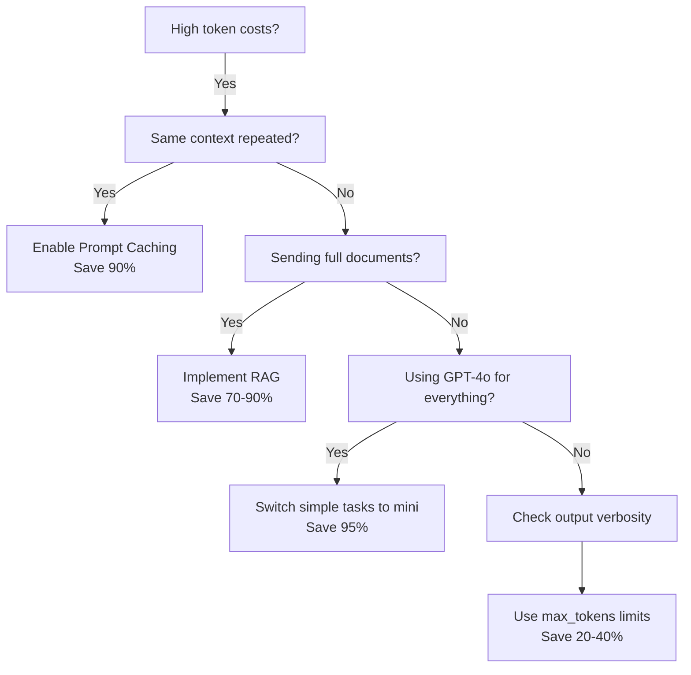

# Token Cost Optimization Quick Reference Card

> **Use this when:** Your AI bill is growing and you need quick wins

---
## Decision Tree



---
## Quick Wins Ranked by Impact

| Strategy | Effort | Savings | Time to Implement |
|---------|--------|---------|-------------------|
| **1. Enable Prompt Caching** | Low | 40-90% | 15 min |
| **2. Implement RAG** | Medium | 70-90% | 4 hours |
| **3. Switch to -mini for simple tasks** | Low | 85-95% | 30 min |
| **4. Set max_tokens limits** | Low | 20-40% | 10 min |
| **5. Compress prompts** | Medium | 30-50% | 2 hours |
| **6. Use cheaper models** | Low | 50-80% | 20 min |

---
## Common Commands

### Enable Caching (Anthropic)
```python
# Mark static content for caching
system=[
    {
        "type": "text",
        "text": "Your large static context...",
        "cache_control": {"type": "ephemeral"}
    }
]
```

### Limit Output Tokens
```python
# Prevent runaway costs
response = client.messages.create(
    model="claude-sonnet-4-20250514",
    max_tokens=500,  # Set explicit limit
    messages=[...]
)
```

### Count Tokens Before Sending
```python
import tiktoken

def count_tokens(text, model="gpt-4"):
    encoding = tiktoken.encoding_for_model(model)
    return len(encoding.encode(text))

# Check before sending
prompt = "Your prompt here..."
token_count = count_tokens(prompt)
print(f"This will cost approximately ${token_count * 0.003 / 1000:.4f}")
```

---
## Key Formulas

**Basic Cost Calculation:**
```
Cost = (Input Tokens × Input Price/1K) + (Output Tokens × Output Price/1K)
```

**With Caching:**
```
First Request = Full Input Cost + Output Cost
Cached Requests = (Input × 0.10) + Output Cost
```

**ROI of Optimization:**
```
Monthly Savings = Current Cost - Optimized Cost
Payback Time = (Hours to Implement × Hourly Rate) / Monthly Savings
```

**Example:**
- Current: 10M tokens/mo @ $3/1M = $30/mo
- After RAG: 2M tokens/mo @ $3/1M = $6/mo
- Savings: $24/mo
- Time invested: 4 hours @ $100/hr = $400
- Payback: 400/24 = 16.7 months ❌ (not worth it at this scale)

But at 100M tokens/mo:
- Savings: $240/mo
- Payback: 400/240 = 1.7 months ✅ (worth it!)

---
## Model Cost At-a-Glance

| Model | Input $/1M | Output $/1M | Best For |
|-------|-----------|-------------|----------|
| **GPT-4o-mini** | $0.15 | $0.60 | High volume, simple tasks |
| **Gemini 1.5 Flash** | $0.075 | $0.30 | Cheapest general purpose |
| **GPT-4o** | $2.50 | $10.00 | Balanced quality/cost |
| **Claude 3.5 Sonnet** | $3.00 | $15.00 | Quality-critical tasks |
| **Claude Haiku** | $0.25 | $1.25 | Fast, simple tasks |

---
## Optimization Checklist

- [ ] **Audit current usage** - Know your baseline (tokens/day, cost/query)
- [ ] **Enable prompt caching** - If sending same context >2x
- [ ] **Implement RAG** - If sending full documents every query
- [ ] **Use tiered models** - mini for simple, premium for complex
- [ ] **Set max_tokens** - Prevent runaway responses
- [ ] **Compress system prompts** - Remove fluff, keep substance
- [ ] **Batch requests** - Combine similar queries when possible
- [ ] **Monitor daily** - Set up alerts at 50%, 75%, 90% of budget

---
## Red Flags (You're Wasting Money If...)

| Red Flag | What's Wrong | Quick Fix |
|----------|-------------|-----------|
| Same 50K context in every request | Not using caching | Enable prompt caching |
| Sending entire PDFs to LLM | Not using RAG | Implement chunking + retrieval |
| Using GPT-4o for "yes/no" answers | Overkill model | Switch to mini |
| Average response is 2000 tokens | No output limit | Set max_tokens=500 |
| $1000/mo but <10K requests | Inefficient prompts | Audit and compress |

---
## Real-World Savings Examples

**Example 1: Support Chatbot**
- Volume: 5000 queries/day
- Before: Full 10K doc context each query
- Cost: 5000 × 10K × $3/1M = $150/day
- **Fix:** RAG (retrieve 2K relevant chunks)
- After: 5000 × 2K × $3/1M = $30/day
- **Savings:** $120/day = $3600/month

**Example 2: Code Review Bot**
- Volume: 500 reviews/day
- Before: GPT-4o for all reviews
- Cost: 500 × 5K tokens × $2.50/1M = $6.25/day
- **Fix:** Use mini for simple linting, GPT-4o for complex logic
- After: (400 × 5K × $0.15/1M) + (100 × 5K × $2.50/1M) = $0.30 + $1.25 = $1.55/day
- **Savings:** $4.70/day = $141/month

**Example 3: Document Q&A**
- Volume: 1000 queries/day, same knowledge base
- Before: 1000 × 15K context × $3/1M = $45/day
- **Fix:** Prompt caching enabled
- After: 15K × $3/1M + (999 × 15K × $0.30/1M) = $0.045 + $4.50 = $4.55/day
- **Savings:** $40.45/day = $1213.50/month

---
## See Full Guides

- [[Token Economics - Deep Dive]]
- [[Prompt Caching Tutorial]]
- [[RAG Implementation Guide]]
- [[Model Selection Decision Tree]]

---
## Last Updated

April 24, 2026 - Pricing current as of this date, verify with providers before major decisions
