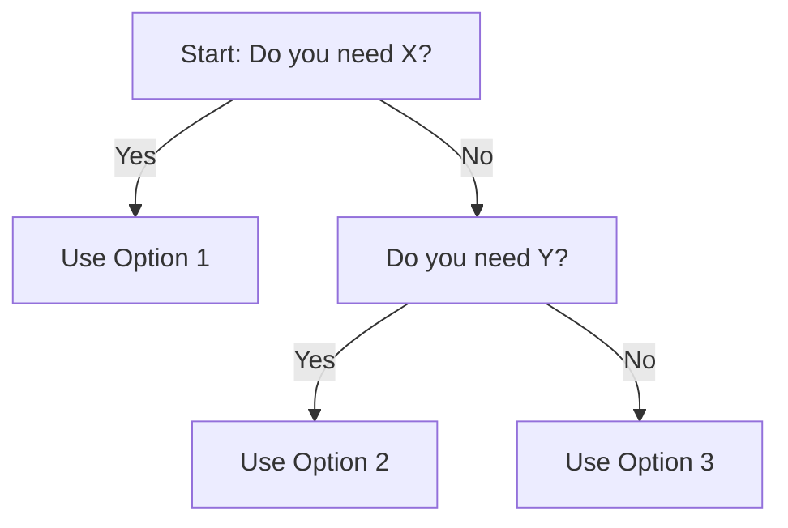

# {{title}} Quick Reference Card

> **Use this when:** [Specific scenario]

---
## Decision Tree



---
## Comparison Matrix

| Feature | Option A | Option B | Option C |
|---------|----------|----------|----------|
| **Cost** | $ | $$ | $$$ |
| **Speed** | Fast | Medium | Slow |
| **Best For** | [Use case] | [Use case] | [Use case] |
| **Limitations** | [Key limit] | [Key limit] | [Key limit] |

---
## Common Commands

```bash
# Task 1: [Description]
command --flag value

# Task 2: [Description]
another-command --option
```

---
## Key Formulas

**Token Cost Calculation:**